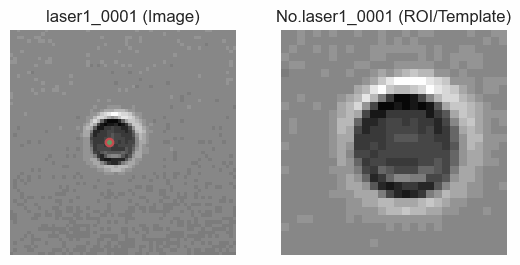
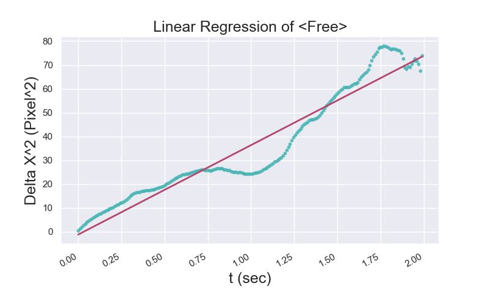
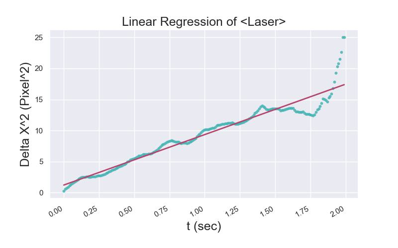

# Particle-Tracking-OpenCV
> This project is inspired by a hands-on lecture (Brownian motion exp.) in school. The main goal of this project is to extend self-learning programing skill and provide tools to optimize the workflow. Currently, looking forward to share with junior students! 

## Sample result
 

 


## Steps to follow
1. Organize input data (tif images) by group and store in respective folder 

```text
Folder_Name_List = ['1', '2', '3', '4', '5','Free','Laser']
```

2. Program Setup

```text
# Step1 Clone this repository to your folder 
$ git clone https://github.com/sc0210/Particle-Tracking-OpenCV.git

# Step2 Move current working directory into the folder.
$ cd Particle-Tracking-OpenCV

# Step3 Install package used this project 
$ pip install -r requirements

# Step4 Execute main program (data must involve in the same folder path)
$ python main.py
```

3. Analyze done! Check up the result in `./Export`

## Current updated ***(10/14)***
1. Add different mode of tracking methods
2. Add export excel sheet of particle tracking results
3. Revised the computing algorithm

## Check list  
***(last updated 8/24***)
- [ ] Part 1 Develop tools with funcitons listed bellow 
  - [x] Read several types(tif, jpg, png) of image
    ```
    - ReadGrayImg(RscPath, show=False)
    ```
  - [x] Convert sequences of images into animation 
    ```
    - IMG2MP4(SrcFolder,OutFolder,OutName,FPS=5)
    - PNG2GIF(SrcFolder,OutFolder,OutName,ImgFormat="png", duration=120)
    ```
  - [x] Image preprocessing (kernel/ filter) (edge detection/ blur/ sharpen/ fill)
    ```
    - dog(img,size=(0,0),k=1.6,sigma=0.5,gamma=1)
    - xdog(img,sigma=0.5,k=1.6, gamma=1,epsilon=1,phi=1)
    - xdog_garygrossi(img,sigma=0.5,k=200, gamma=0.98,epsilon=0.1,phi=10)
    ```
  - [x] Relation beetween sequentail of images 
    ```
    - normxcorr2(template,image,mode="full")
    - Track(SrcFolder,OutFolder,OutName="test",SavePlot=True)
    ```
  - [ ] Coefficient of viscosity
  - [x] Graph the in XY cororidnated system
    ```
    - MSD(X,Y,OutFolder,filename,length,ImgShow=False)
    - MDD(X,Y,OutFolder,filename,length,ImgShow=False)
    ```
 
- [x] Part 2 Organized and record the process
  - [x] Github -> *Create this repository!* 
  - [x] TA (teaching material, demo code, ppt)

## References 
1. HoughCircles() (OpenCV document) [https://reurl.cc/0XZbxb]
2. Canny edge detection (OpenCV document) [https://reurl.cc/GEK9xy]
3. Python OpenCV 影像二值化 Image Thresholding [https://reurl.cc/D3Ax9e]
4. cv2霍夫圓環檢測（HoughCircle）[https://reurl.cc/KQ02k9]
5. Git remote connection [https://reurl.cc/rR50xZ]
