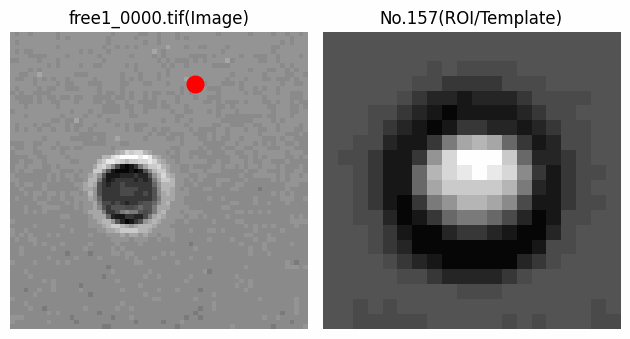
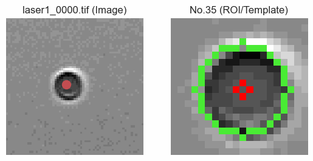
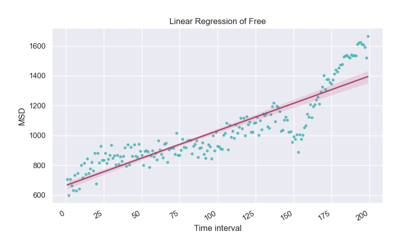

# Particle-Tracking-python-OpenCV
> This project is inspired by a hands-on lecture (Brownian motion exp.) in school. The main goal of this project is to extend self-learning programing skill and provide more convenient tools to optimized the postprocessing. Looking forward to share with junior students! 

## Sample result

## Steps to follow
1. Clone this repository to your folder via `git clone https://github.com/samchen0210/Particle-Tracking-python-OpenCV.git`
2. `cd Particle-Tracking` to move current working directory into the folder.
3. Install package used this project `pip install -r requirements` in the terminal.
4. Organize input data (tif images) by group and store in respective folder `folder name list = ['1', '2', '3', '4', '5','Free','Laser','Control]`
5. Execute main program via typing`python main.py` in the terminal with data store in the same path.
6. Check up the result in `./Export`

## Check list  
***(last updated 8/22***)
- [ ] Part 1 Develop tools with funcitons listed bellow 
  - [x] Read several types(tif, jpg, png) of image
  - `ReadGrayImg(RscPath, show=False)`
  - [x] Convert sequences of images into animation 
  - `IMG2MP4(SrcFolder,OutFolder,OutName,FPS=5)`
  - `PNG2GIF(SrcFolder,OutFolder,OutName,ImgFormat="png", duration=120)`
  - [ ] Image preprocessing (kernel/ filter) (edge detection/ blur/ sharpen/ fill)
  - [x] Relation beetween sequentail of images 
  - `normxcorr2(template,image,mode="full")`
  - `Track(SrcFolder,OutFolder,OutName="test",SavePlot=True)`
  - [ ] Coefficient of viscosity
  - [x] Graph the in XY cororidnated system
  - `MSD(X ,Y,OutFolder,filename,length,ImgShow=False)`
  
- [ ] Part 2 Organized and record the process
  - [ ] Github -> *Create this repository!* 
  - [ ] TA (teaching material, demo code, ppt)

## References 
1. Python OpenCV 影像二值化 Image Thresholding [https://reurl.cc/D3Ax9e]
2. cv2霍夫圓環檢測（HoughCircle）[https://reurl.cc/KQ02k9]
3. Git remote connection [https://reurl.cc/rR50xZ]
